# АНАЛИЗ ДАННЫХ И ИСКУССТВЕННЫЙ ИНТЕЛЛЕКТ [in GameDev]
Отчет по лабораторной работе #1 выполнил(а):
- Лубенец Илья Игоревич
- 1994844

Отметка о выполнении заданий (заполняется студентом):

| Задание | Выполнение | Баллы |
| ------ | ------ | ------ |
| Задание 1 | * | 60 |
| Задание 2 | * | 20 |
| Задание 3 | * | 20 |

знак "*" - задание выполнено; знак "#" - задание не выполнено;

Работу проверили:
- к.т.н., доцент Денисов Д.В.
- к.э.н., доцент Панов М.А.
- ст. преп., Фадеев В.О.

Структура отчета

- Данные о работе: название работы, фио, группа, выполненные задания.
- Цель работы.
- Задание 1.
- Код реализации выполнения задания. Визуализация результатов выполнения (если применимо).
- Задание 2.
- Код реализации выполнения задания. Визуализация результатов выполнения (если применимо).
- Задание 3.
- Код реализации выполнения задания. Визуализация результатов выполнения (если применимо).
- Выводы.
- ✨Magic ✨

## Цель работы
Ознакомиться с основными операторами зыка Python на примере реализации линейной регрессии.

## Задание 1
### Пошагово выполнить каждый пункт раздела "ход работы" с описанием и примерами реализации задач
Ход работы:
1)	Создать новый проект из шаблона 3D – Core;
2)	Проверить, что настроена интеграция редактора Unity и Visual Studio Code (пункты 8-10 введения);
3)	Создать объект Plane;
4)	Создать объект Cube;
5)	Создать объект Sphere;
6)	Установить компонент Sphere Collider для объекта Sphere;
7)	Настроить Sphere Collider в роли триггера;
8)	Объект куб перекрасить в красный цвет;
9)	Добавить кубу симуляцию физики, при это куб не должен проваливаться под Plane;
10) Написать скрипт, который будет выводить в консоль сообщение о том, что объект Sphere столкнулся с объектом Cube;
11) При столкновении Cube должен менять свой цвет на зелёный, а при завершении столкновения обратно на красный.

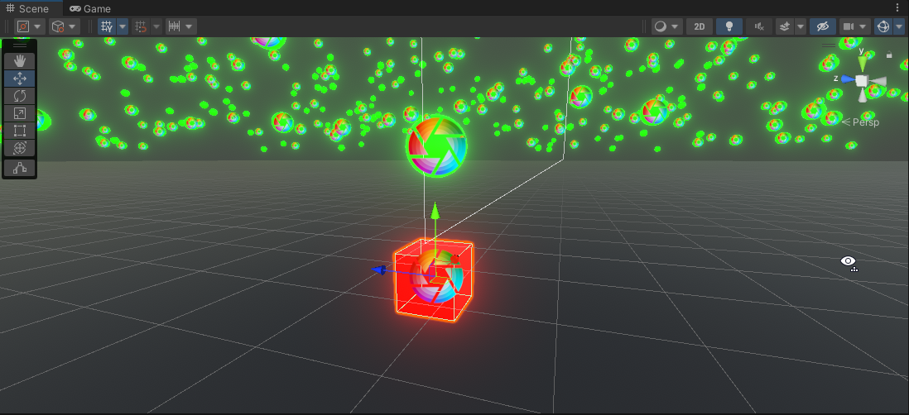
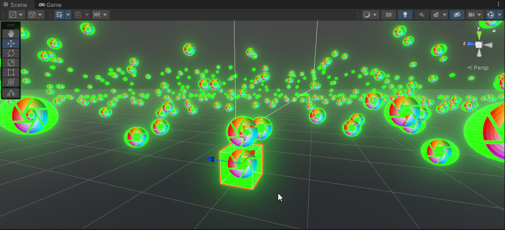
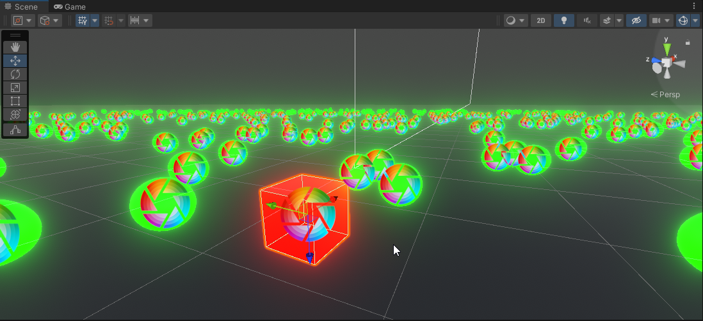

## Задание 2
### Продемонстрируйте на сцене в Unity следующее:

- Что произойдёт с координатами объекта, если он перестанет быть дочерним?
- Создайте три различных примера работы компонента RigidBody?

Ход работы:

- Координаты дочерних объектов всегда относительны от родительского класса. Если у родительского класса координаы `(50, 50, 50)`, то координаты его дочернего объекта будут `(0, 0, 0)`, но в игровом пространстве это будут одни и те же координаты, так как на координаты дочерних объектов нужно смотреть, как на сумму всех его родительских координат `(*parentsX + childX, *parentY + childY, *parentZ + childZ)`.

1. Координаты родительского объекта (Position справа вверху)

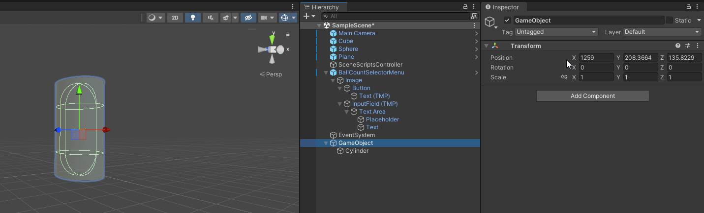

2. Координаты дочернего объекта (Postition справа вверху)

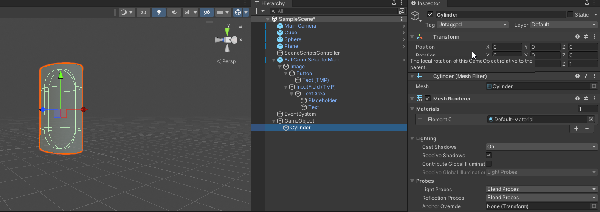

3. Координаты дочернего объекта после удаления связи (Postition справа вверху)

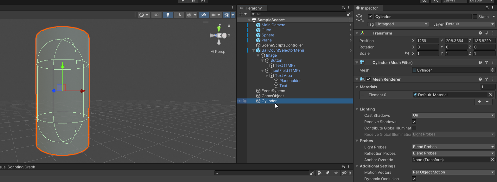

- На сцене у меня несколько объектов Rigidbody в связке с подходящими для них Collider'ами:

1. Cube
2. Sphere
3. Plane (Kinematic)
4. Camera (Kinematic) (для того чтобы расталкивать камерой объекты)

## Задание 3
### Реализуйте на сцене генерацию n кубиков. Число n вводится пользователем после старта сцены.

Ход работы:

- При загрузке сцены игра ставится на паузу, отображается UI для выбора количества шариков для спавна. Лучше всего использовать близкое к 1000 и камерой толкать куб к шарику или наоборот. После ввода числа и нажатии на кнопку, шарики спавнятся в рандомном точке с предустановленным радиусом границы спавна камере даётся доступ к управлению. (зажать ПКМ и WASD + Shift (скрипт для камеры взят из Core RP и был немного видоизменен для возможности отключения скрипта из другого скрипта))

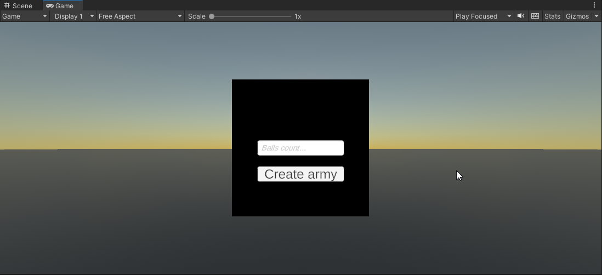
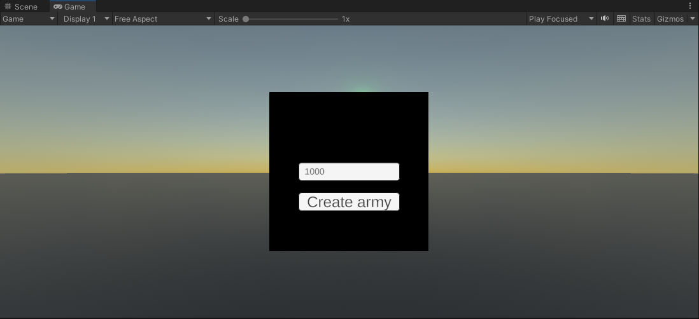
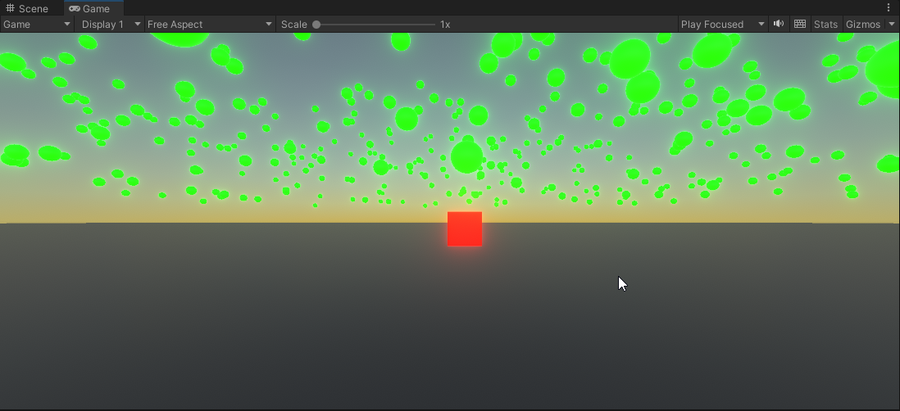
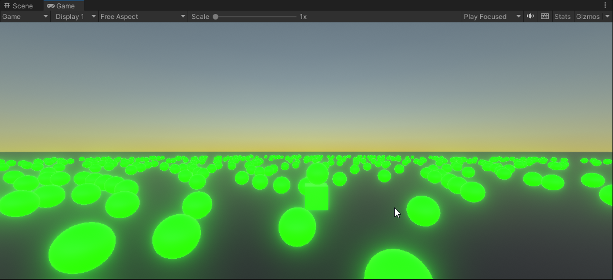
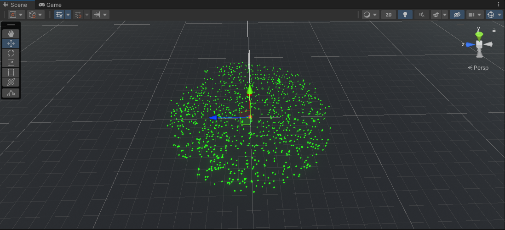

Так же в папке лежит видео - `./readme_img/Video.mp4` c полным показом функционала.

## Выводы

Ничего нового не узнал, делал такое и раньше.

| Plugin | README |
| ------ | ------ |
| Dropbox | [plugins/dropbox/README.md][PlDb] |
| GitHub | [plugins/github/README.md][PlGh] |
| Google Drive | [plugins/googledrive/README.md][PlGd] |
| OneDrive | [plugins/onedrive/README.md][PlOd] |
| Medium | [plugins/medium/README.md][PlMe] |
| Google Analytics | [plugins/googleanalytics/README.md][PlGa] |

## Powered by

**BigDigital Team: Denisov | Fadeev | Panov**
